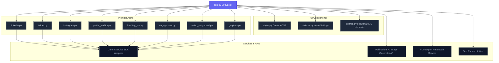

# 🚀 Growth Engine AI (v3.0 Modular Rewrite)


**An enterprise-grade, Human-in-the-Loop (HITL) social velocity platform to generate influencer-level content for LinkedIn, X (Twitter), and Instagram, analyze engagement potential, generate visuals, and schedule posts.**

---

## 📖 Overview

**Growth Engine AI v3.0** completely refactors the monolithic application into a highly maintainable, modular structure. It introduces influencer-pacing prompts, robust A/B testing hooks, profile auditing, and dynamic graphic generation without needing paid design tools or complex API keys.

---

## 🎨 System Architecture

The following diagram illustrates how the modular components communicate with one another:



---

## 🌟 Key Features

* **💼 LinkedIn Studio (Influencer Pacing)**
  - Generates posts with highly optimized hook placements and paragraph pacing.
  - Custom JavaScript **Copy & Open** button copies the full formatting to clipboard and redirects to LinkedIn feed to bypass URL truncation bugs.
  - Inline AI Image Generator and **Engagement Rate Analytics**.
* **🐦 Twitter/X Thread Smith**
  - Generates full character-capped threads with strong curiosity gaps.
  - Integrated post scheduler and analytics.
* **📸 Instagram & Reels Suite**
  - Captions optimized for saves and shares.
  - **Reels / Short Video Storyboarder** providing visual directions, voiceover script, and editor notes second-by-second.
* **🧬 Voice DNA Extractor**
  - Analyzes your previous posts to create a customizable style profile.
* **🔬 Post Autopsy & Reverse Engineering**
  - Feed your top-performing past posts to reverse-engineer their core templates.
* **🎨 Visual Studio**
  - Dynamic image generation with multiple aspect ratios (Portrait, Square, Landscape) powered by **Pollinations AI** (using Flux models).
* **🔍 Profile Auditor**
  - Direct Personal Brand Consultant scoring bios out of 10 and offering rewrite versions.
* **🏷️ Hashtag Lab**
  - Tier-structured reach sets (Broad, Niche, Targeted).
* **📅 Content Scheduler**
  - Save posts with scheduled dates and times. Stores data locally in `scheduled_posts.json` for custom queue exports.

---

## 📂 Project Directory Structure

```text
growth_engine_app/
├── app.py                  # Main layout and tab controller
├── requirements.txt        # Modular dependency listings
├── scheduled_posts.json    # Local schedule cache (auto-created)
├── components/             # Frontend UI Modules
│   ├── shared.py           # Custom JS clipboard copying and sharing elements
│   ├── sidebar.py          # Brand Voice controller and history manager
│   └── styles.py           # Premium stylesheet injector
├── config/                 # Configurations and Limits
│   └── settings.py         # Model listings, Platform constraints, Banned words
├── prompts/                # Dedicated prompt builders
│   ├── engagement.py       # Engagement and readability analysis prompts
│   ├── graphics.py         # Detailed graphic generators prompt
│   ├── hashtag_lab.py      # Tiered hashtag strategies prompt
│   ├── hooks.py            # Psychological hook rewriters
│   ├── instagram.py        # Instagram captions prompt builder
│   ├── linkedin.py         # LinkedIn viral pacing prompt builder
│   ├── post_autopsy.py     # Reverse-engineering templates
│   ├── profile_auditor.py  # Profile audit checklists
│   ├── twitter.py          # Twitter/X thread formatting
│   └── video_storyboard.py # Short-video storyboards & cues
├── services/               # Core business utilities
│   ├── gemini_service.py   # unified SDK Client (old & new SDK fallback)
│   ├── pdf_export.py       # PDF document construction using ReportLab
│   └── text_parser.py      # regex matching & tweet segment splitters
└── tests/                  # Pytest validation suites
    ├── test_gemini_service.py
    └── test_text_parser.py
```

---

## 🚀 Local Setup & Installation

### 1. Clone & Enter Repository
```bash
git clone https://github.com/Shweta-Mishra-ai/growth_engine_app.git
cd growth_engine_app
```

### 2. Install Dependencies
Ensure you have Python 3.10+ installed.
```bash
pip install -r requirements.txt
```

### 3. Setup Secrets
Create a folder `.streamlit/` and place `secrets.toml` inside:
```toml
# .streamlit/secrets.toml
GOOGLE_API_KEY = "AIzaSy...[PASTE YOUR KEY HERE]"
```

### 4. Run Testing Suite
Before boot, verify imports and model mock pathways work correctly:
```bash
python -m pytest
```

### 5. Launch Streamlit Application
```bash
python -m streamlit run app.py
```

---

## 🤝 Contributing

Contributions are welcome! Feel free to branch, add features, and submit a Pull Request.

Built with ❤️ by Shweta Mishra
