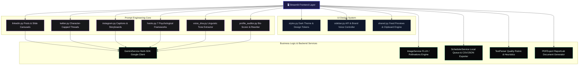

<div align="center">

# 🚀 Growth Engine AI

### Enterprise Social Velocity & Organic Growth Operating System

An autonomous, Human-in-the-Loop (HITL) content engine that engineers viral, platform-native content across LinkedIn, X (Twitter), and Instagram — powered by Google Gemini 2.5 Flash, Flux visual generation, deterministic quality scoring, and automated scheduling.

[](https://www.python.org/)
[](https://streamlit.io/)
[](https://ai.google.dev/)
[](https://pollinations.ai/)
[-10B981?style=for-the-badge&logo=pytest&logoColor=white)](https://github.com/Shweta-Mishra-ai/growth_engine_app)
[](LICENSE)

[Features](#-core-capabilities) • [Architecture](#-system-architecture) • [Quality Scoring](#-deterministic-quality-rubric) • [Quickstart](#-quickstart--deployment) • [Testing](#-verification--testing)

</div>

---

## ⚡ The Problem & The Solution

| Traditional AI Content Tools | 🚀 Growth Engine AI v3.1 |
| :--- | :--- |
| **Generic, robot-sounding prose** laden with AI clichés (*"In today's fast-paced world...", "game-changer"*). | **Zero-cliché strict filter**: Enforced heuristic bans on corporate buzzwords with native platform pacing. |
| **One-size-fits-all text** with no platform awareness. | **Platform-specific token mechanics**: Mobile "see more" cutoff hooks for LinkedIn, strict 280-char caps for X, carousel decks, and Instagram saves-optimized copy. |
| **Hallucinated quality**: No metrics on whether a post will actually perform. | **Algorithmic Quality Rubric**: Deterministic 0–100 quality scoring + Grade A–D analyzing dwell time, hook stopping power, mobile line breaks, and comment CTAs. |
| **Manual copying hassles & lost formatting**. | **1-Click Native Share**: Custom clipboard engine with immediate redirect to platform feeds with preserved layout. |
| **External graphic creation needed**. | **Built-in Visual Studio**: Instant generation of tailored 16:9 banners, 1:1 carousels, and 4:5 portraits via FLUX. |

---

## 🌟 Core Capabilities

```
Growth Engine AI
├── 💼 LinkedIn Studio
│   ├── 6 Viral Pacing Formats (Hook-Story-Lesson, Contrarian Take, Listicle, Case Study, etc.)
│   ├── Document Carousel Deck Architect (Multi-slide engagement driver)
│   ├── Deterministic Quality Score Gauge (0-100 rubric & actionable tips)
│   └── Feed Simulation Preview & 1-Click Clipboard + Feed Dispatcher
│
├── 🐦 Twitter/X Thread Smith
│   ├── Full-thread generator with psychological curiosity gaps
│   ├── Per-tweet character validation cards (<280 hard limit with real-time alerts)
│   └── 1-Click thread clipboard copy & web composer launch
│
├── 📸 Instagram Suite
│   ├── A/B Caption Lab: Version A (Hook-driven) & Version B (Storytelling)
│   ├── Story Teasers & 3-Tier Hashtags
│   └── Reels & TikTok Storyboarder (Second-by-second visual directions & voiceover scripts)
│
├── 🎣 Psychological Hooks Lab
│   └── 7 High-Converting Frameworks (Curiosity Gap, Bold Claim, Counterintuitive, Empathy, etc.)
│
├── 🧬 Voice DNA Extractor
│   ├── Multi-sample linguistic analysis (Sentence rhythm, vocabulary level, signature quirks)
│   └── Global tone-matching engine applied across all generator modules
│
├── 🔬 Post Autopsy & Re-engineering
│   └── Deconstructs viral reference posts into reusable structural blueprints
│
├── 🔍 Profile & Bio Auditor
│   └── Personal Brand Consultant scoring bios out of 10 with 3 executive rewrites
│
├── 🎨 Visual Studio 2.0
│   ├── Standalone text-to-image engine powered by Flux
│   └── 8 Curated art styles (3D Clay, Minimalist Flat, Tech Vector, Photorealistic, etc.)
│
└── 📅 Content Schedule Dashboard
    ├── Queue manager across LinkedIn, Twitter/X, and Instagram
    └── Instant export to structured CSV and JSON
```

---

## 🏗️ System Architecture


```mermaid
graph TD
    classDef client fill:#1e1b4b,stroke:#6366f1,stroke-width:2px,color:#e0e7ff;
    classDef comp fill:#0f172a,stroke:#334155,stroke-width:1px,color:#cbd5e1;
    classDef engine fill:#18181b,stroke:#a855f7,stroke-width:1px,color:#f3e8ff;
    classDef svc fill:#09090b,stroke:#10b981,stroke-width:1px,color:#ecfdf5;

    Client[🖥️ Streamlit Frontend Layer]:::client
    
    subgraph UI Design System
        CSS[styles.py Dark Theme & Design Tokens]:::comp
        Side[sidebar.py API & Brand Voice Controller]:::comp
        Shared[shared.py Feed Previews & Clipboard Engine]:::comp
    end

    subgraph Prompt Engineering Core
        PLI[linkedin.py Posts & Slide Carousels]:::engine
        PTW[twitter.py Character-Capped Threads]:::engine
        PIG[instagram.py Captions & Storyboards]:::engine
        PHook[hooks.py 7 Psychological Frameworks]:::engine
        PDNA[voice_dna.py Linguistic Tone Extractor]:::engine
        PAudit[profile_auditor.py Bio Scorer & Rewriter]:::engine
    end

    subgraph Business Logic & Backend Services
        GSVC[GeminiService Multi-SDK Google Client]:::svc
        ISVC[ImageService FLUX / Pollinations Engine]:::svc
        SSVC[SchedulerService Local Queue & CSV/JSON Exporter]:::svc
        PSVC[TextParser Quality Rubric & Heuristics]:::svc
        PDF[PDFExport ReportLab Document Generator]:::svc
    end

    Client --> CSS & Side & Shared
    Client --> PLI & PTW & PIG & PHook & PDNA & PAudit
    PLI & PTW & PIG & PHook & PDNA & PAudit --> GSVC
    Client --> ISVC & SSVC & PSVC & PDF
```

---

## 📊 Deterministic Quality Rubric

Unlike standard wrappers that rely solely on subjective LLM evaluations, Growth Engine AI features an **in-memory deterministic scoring rubric** for LinkedIn content:

$$\text{Quality Score} = \frac{\sum(\text{Length} + \text{Hook} + \text{Spacing} + \text{CTA} + \text{Hashtags} + \text{Language})}{6}$$

| Dimension | Standard | Scoring Logic |
| :--- | :--- | :--- |
| **Hook Stopping Power** | First 80 characters | Evaluates character brevity before the mobile `"see more"` fold, awards bonus for concrete numerical anchors, severely penalizes generic openings (*"Excited to share..."*). |
| **Mobile Readability** | Spacing & Line breaks | Requires blank lines between thoughts (minimum 4 blank lines per post) to avoid mobile "wall of text" bounce rates. |
| **Dwell Time Optimization** | Word count | Targets 180–300 words. Short posts (<100 words) are penalized for insufficient dwell time. |
| **Comment Acceleration** | Closing question | Verifies presence of a thought-provoking, non-generic interrogation within the final 300 characters. |
| **Hashtag Matrix** | Distribution | Enforces 3–5 targeted niche hashtags placed exclusively on the trailing line. |
| **Cliché Neutralization** | Corporate buzzwords | Scans for blacklisted phrases (*"dive deep", "game-changer", "synergy", "paradigm shift"*) and penalizes score accordingly. |

---

## 🚀 Quickstart & Deployment

### Prerequisites
* Python 3.10, 3.11, or 3.12
* A free Google Gemini API Key from [Google AI Studio](https://aistudio.google.com/app/apikey)

### 1. Installation
```bash
# Clone the repository
git clone https://github.com/Shweta-Mishra-ai/growth_engine_app.git
cd growth_engine_app

# Install production dependencies
pip install -r requirements.txt

# (Optional) Install development & testing tooling
pip install -r requirements-dev.txt
```

### 2. Configuration
You can input your API key directly into the secure **Settings** panel in the web application sidebar, or configure it via secrets:

```bash
mkdir -p .streamlit
cat << EOF > .streamlit/secrets.toml
GOOGLE_API_KEY = "your_actual_gemini_api_key_here"
EOF
```

### 3. Launch Application
```bash
python -m streamlit run app.py
```
Access the application at `http://localhost:8501`.

---

## 🧪 Verification & Testing

Growth Engine AI is verified with a comprehensive automated test suite consisting of **109 unit tests**:

```bash
python -m pytest tests -v
```

```text
============================= test session starts =============================
platform win32 -- Python 3.11+, pytest-9.x, pluggy-1.x
collected 109 items

tests/test_gemini_service.py .....                                       [  4%]
tests/test_image_service.py ............                                 [ 15%]
tests/test_pdf_export.py ...                                             [ 18%]
tests/test_prompts.py .................................................  [ 59%]
tests/test_scheduler.py .....                                            [ 64%]
tests/test_text_parser.py ...........................................    [100%]

============================== 109 passed in 1.47s ==============================
```

---

## 🛠️ Technology Stack

| Layer | Technology |
| :--- | :--- |
| **Frontend & UI** | Streamlit 1.35+, Space Grotesk & Inter Typography, Custom CSS Design Tokens |
| **Core Intelligence** | Google Gemini 2.5 Flash (`google-genai` SDK + `google-generativeai` auto-fallback) |
| **Image Synthesis** | FLUX.1 via Pollinations AI Engine (Multi-model: Standard, Realism, Anime) |
| **Scheduling Engine** | Local JSON File-backed Queue with CSV & JSON Export |
| **Document Export** | ReportLab 4.x (PDF), Markdown, JSON |
| **Quality Assurance** | Pytest, Pytest-Mock, Ruff |

---

## 🤝 Contributing & Community

Contributions are welcomed and encouraged!
1. Fork the Project
2. Create your Feature Branch (`git checkout -b feature/AmazingFeature`)
3. Ensure all tests pass (`python -m pytest`)
4. Commit your Changes (`git commit -m 'feat: Add AmazingFeature'`)
5. Push to the Branch (`git push origin feature/AmazingFeature`)
6. Open a Pull Request

---

## 📄 License

Distributed under the MIT License. See `LICENSE` for more information.

<div align="center">
Built with ❤️ by <b>Shweta Mishra</b>
</div>
