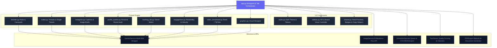

# 🚀 Growth Engine AI (v3.1 Comprehensive Upgrade)


**An enterprise-grade, Human-in-the-Loop (HITL) social velocity platform to generate viral content for LinkedIn, X (Twitter), and Instagram, analyze engagement velocity, produce stunning visuals, and manage content schedules.**

---

## 📖 Overview

**Growth Engine AI v3.1** brings a major performance, UI/UX, and architectural upgrade to the platform:
* **UI/UX Overhaul**: Modern dark theme with Space Grotesk and Inter typography, responsive tab containers, authentic feed simulation previews, and crisp component layouts.
* **Algorithmic Quality Scoring**: Instant, deterministic quality rubric scoring LinkedIn posts (Grade A–D / 100) on hook strength, mobile spacing, word count dwell time, CTA questions, hashtags, and AI clichés.
* **LinkedIn Carousel Generator**: Slide-by-slide multi-slide carousel generator engineered for high dwell time.
* **Dedicated Content Schedule Manager**: Complete calendar dashboard to view, filter, copy, cancel, and export scheduled posts across LinkedIn, Twitter, and Instagram to CSV and JSON.
* **Visual Studio 2.0**: Standalone and inline AI graphic generation powered by Flux with 8 curated art styles and 4 aspect ratios (Landscape 16:9, Square 1:1, Portrait 4:5, Story 9:16).
* **In-App API Key Configuration**: Seamless API key entry directly in the sidebar with live status indicator and secrets fallback.
* **Comprehensive Test Suite**: 109 automated unit tests verifying prompts, token limits, parsers, schedulers, image services, and exports.

---

## 🎨 System Architecture


```mermaid
graph TD
    classDef main fill:#6366f1,stroke:#4f46e5,stroke-width:2px,color:#fff;
    classDef comp fill:#1e293b,stroke:#475569,stroke-width:1px,color:#cbd5e1;
    classDef svc fill:#0f172a,stroke:#334155,stroke-width:1px,color:#94a3b8;

    A[app.py Entrypoint & Tab Orchestrator]:::main
    
    subgraph UI Components
        B[styles.py Dark Theme & Tokens]:::comp
        C[sidebar.py API & Brand Voice Controller]:::comp
        D[shared.py Feed Previews, Badges & Copy Helpers]:::comp
    end
    
    subgraph Prompt Engine
        E[linkedin.py Posts & Carousels]:::comp
        F[twitter.py Threads & Single Tweets]:::comp
        G[instagram.py Captions & Image Briefs]:::comp
        H[profile_auditor.py Personal Brand Audit]:::comp
        I[hashtag_lab.py Tiered Matrix]:::comp
        J[engagement.py Readability & Velocity]:::comp
        K[video_storyboard.py Reels / TikToks]:::comp
        L[graphics.py Visual Designer]:::comp
    end
    
    subgraph Services & APIs
        M[GeminiService Multi-SDK Wrapper]:::svc
        N[ImageService Pollinations / Flux API]:::svc
        O[SchedulerService Queue & CSV/JSON Export]:::svc
        P[TextParser Quality Scoring & Cleaners]:::svc
        Q[PDFExport ReportLab Document Generator]:::svc
    end
    
    A --> B
    A --> C
    A --> D
    
    A --> E & F & G & H & I & J & K & L
    E & F & G & H & I & J & K & L --> M
    A --> N
    A --> O
    A --> P
    A --> Q
```

---

## 🌟 Key Features

* **💼 LinkedIn Studio**
  - Hook-Story-Lesson, Contrarian Take, Listicle, Data-Driven, Case Study, and **Carousel Slide Decks**.
  - **Instant Quality Scoring Rubric** (0–100 score + Grade A–D) evaluating dwell time, hook stopping power, mobile spacing, and comments CTA.
  - In-depth AI Engagement & Readability analysis.
  - Native LinkedIn feed simulation preview.
  - 1-Click Copy Post and Open LinkedIn feed.
  - Inline AI Banner generator & post scheduler.

* **🐦 Twitter/X Thread Smith**
  - Character-capped threads (under 280 characters per tweet) with curiosity gaps.
  - Individual tweet cards with character counters and over-limit warnings.
  - One-click copy for the entire thread or individual tweets.
  - 1-Click Copy & Open Twitter/X composer.
  - Inline Thread Graphic generator & post scheduler.

* **📸 Instagram Suite**
  - A/B Captions: Version A (Hook-driven) and Version B (Story-driven) + Story Teasers.
  - One-click copy buttons for Version A, Version B, and Story Teasers.
  - **Reels & Short Video Storyboarder**: Second-by-second visual cues, voiceover script, and editor notes.
  - Inline Visual Generator (Square 1:1, Portrait 4:5, Story 9:16).

* **🎣 Psychological Hooks Lab**
  - Rewrites weak openers into 7 psychological frameworks (Curiosity Gap, Bold Claim, Counterintuitive, Empathy, Social Proof, etc.).

* **🧬 Voice DNA Extractor**
  - Analyzes 2–5 past posts to extract sentence cadence, vocabulary, and tone.
  - Global toggle in sidebar to enforce your Voice DNA across all generations.
  - Instant "Write In My Voice" sandbox.

* **🔬 Post Autopsy & Reverse Engineering**
  - Breaks down viral posts into structural mechanics and applies the winning pattern to new topics.

* **🔍 Profile Auditor**
  - Scores bios out of 10 with actionable feedback and delivers 3 rewritten options (Authority, Conversational, Minimalist).

* **🏷️ Hashtag Lab**
  - 3-tier reach sets: High Reach (Broad), Niche Authority, and Community Micro-tags.

* **🎨 Visual Studio**
  - Standalone graphic generator powered by Flux with 8 styles (Modern Illustration, Photorealistic, 3D Render, Cyberpunk, etc.) and direct PNG download.

* **📅 Content Schedule Manager**
  - Calendar dashboard to view, filter, copy, cancel, and export scheduled posts across LinkedIn, Twitter, and Instagram to CSV and JSON.

* **📄 Export Center**
  - Export generation history to Markdown (`.md`), JSON (`.json`), and optional styled PDF (`.pdf`).

---

## 📂 Project Directory Structure

```text
growth_engine_app/
├── app.py                      # Main layout and tab controller (v3.1)
├── requirements.txt            # Core dependencies
├── requirements-dev.txt        # Test and lint dependencies
├── scheduled_posts.json        # Local schedule cache (auto-created)
├── components/                 # Frontend UI Modules
│   ├── shared.py               # Feed previews, score badges, copy & share buttons
│   ├── sidebar.py              # API key config, Brand Voice, and session stats
│   └── styles.py               # Modern dark theme tokens and component styles
├── config/                     # Configuration and limits
│   └── settings.py             # Model settings, word limits, image styles, version
├── prompts/                    # High-converting prompt builders
│   ├── engagement.py           # Engagement and readability analysis prompts
│   ├── graphics.py             # Visual prompt generator
│   ├── hashtag_lab.py          # Tiered hashtag strategies prompt
│   ├── hooks.py                # Psychological hook rewriters (7 frameworks)
│   ├── instagram.py            # Instagram captions and visual briefs
│   ├── linkedin.py             # LinkedIn posts and carousel decks
│   ├── post_autopsy.py         # Reverse-engineering templates
│   ├── profile_auditor.py      # Profile audit checklists
│   ├── twitter.py              # Twitter/X threads and single tweets
│   ├── video_storyboard.py     # Short-video storyboards & cues
│   └── voice_dna.py            # Linguistic voice extraction
├── services/                   # Business logic utilities
│   ├── gemini_service.py       # Multi-SDK Google Gemini wrapper with auto-fallback
│   ├── image_service.py        # Pollinations / Flux image generation service
│   ├── scheduler_service.py    # Local queue management and CSV/JSON export
│   ├── text_parser.py          # Quality scoring, word counts, and prompt cleaner
│   └── pdf_export.py           # ReportLab PDF document builder
└── tests/                      # Automated test suite (109 tests)
    ├── test_gemini_service.py  # SDK initialization, mock responses, error classification
    ├── test_image_service.py   # Image service endpoints and prompt builder
    ├── test_pdf_export.py      # PDF document construction
    ├── test_prompts.py         # Prompt syntax, character counts, differentiations
    ├── test_scheduler.py       # Load, save, delete, clear, and export methods
    └── test_text_parser.py     # Scorers, regex extractors, and markdown exports
```

---

## 🚀 Local Setup & Installation

### 1. Clone & Enter Repository
```bash
git clone https://github.com/Shweta-Mishra-ai/growth_engine_app.git
cd growth_engine_app
```

### 2. Install Dependencies
```bash
pip install -r requirements.txt
pip install -r requirements-dev.txt
```

### 3. Setup Secrets (Optional)
You can configure your API key directly in the web app sidebar, or create `.streamlit/secrets.toml`:
```toml
# .streamlit/secrets.toml
GOOGLE_API_KEY = "AIzaSy...[PASTE YOUR KEY HERE]"
```

### 4. Run Testing Suite
```bash
python -m pytest
```

### 5. Launch Streamlit Application
```bash
python -m streamlit run app.py
```

---

## 🤝 Contributing

Contributions are welcome! Please run `python -m pytest` to ensure all tests pass before submitting a Pull Request.

Built with ❤️ by Shweta Mishra
